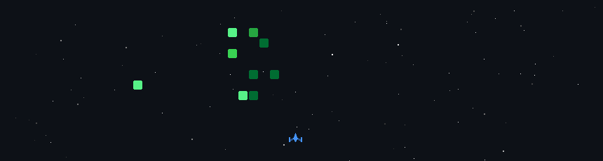

<!-- ANIMATED BACKGROUND -->

  

<h1 align="center">⚡ Diwyanjana ⚡</h1>
<h3 align="center">🌌 Creative Developer | 🛸 Futuristic Thinker | 🔥 Code Artist</h3>

  

---

## 🛠️ Tech Universe

  

---

## 🔥 GitHub Animated Stats

  
  

  

---

## 🪐 Featured Projects  
🔹 **Project A** – Futuristic Web App  
🔹 **Project B** – Neon UI/UX Build  
🔹 **Project C** – AI + Automation  

---

## 🌐 Connect With Me

  

  

  

  

  

  

---

  
### ⭐ Thanks for visiting my animated universe!

